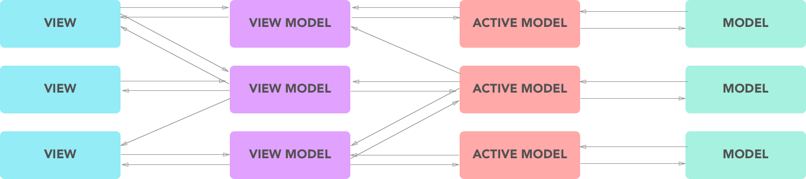

# GHack MVVM Android Framework
Simple Native Android starter kit with MVVM Architecture. (Kotlin)

---

## What's inside?
This starter kit support Data Binding and Dagger for dependency injection. You just need to modify some code and extend some base class to implement this starter kit to fit with your android project. All of the framework stuff is inside "app" package.

## Architecture

| Role Name | Job Description |
| --- | --- |
| View | Display user interface. Almost no logic. As dumb as posible |
| View Model | Handle some logic needed by the View and prepare raw data collected from Active Model and sometimes display it on View. Provides data as an Observer so the View can subscribe on it |
| Active Model | Fetch data from Database / API, doing some Queries and pass that raw data to View Model before the data can be passed to the View |
| Model | It's a passive form of Model. It's only a schema or POJO |

A View Model should not bounded to the View so one View can have multiple View Model. The Active Model also sould not bounded to the View Model so one View Model can have multiple Active Model.

> Sorry for my bad english, this Framework is still on Development. If you want to join me build this Framework, feel free to contact me!.

